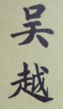
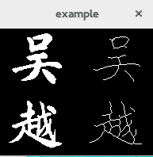

guo-hall-thinning
=================

the implementation of guo-hall thinning algorithm

# Usage:

    mkdir build
    cd build
    cmake ..
    make
    ./guo-hall-thinning

or

    #include "thinning.h"
    
    TheSkeleton skel("dir_to_picture"); // create a TheSkeleton from local image
    
    std::vector< boost::dynamic_bitset<> > resource(...); // create a TheSkeleton from std::vector< boost::dynamic_bitset<> >
    //initialization of resource
    TheSkeleton skel(resource);
    
    skel.thin(threadNum, maxIter); // threadNum by default 2, maxIter by default 0 (no limits on number of iteration)
    
    cv::Mat result = skel.getThinnedImage(); // get the result

# Demo

The original file:

And the result:

